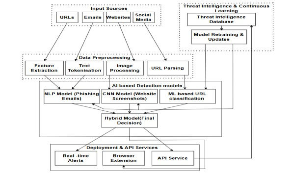

# SafeNet: AI-Powered Real-Time Phishing Detection and Prevention System
## Table of Contents

- [Introduction](#introduction)
- [Problem Definition](#problem-definition)
- [Motivation/Challenges](#motivation)
- [Objectives of the Work](#objectives)
- [System Architecture](#system-architecture)
  - [Phases](#phases)
    - [Data Collection & Preprocessing](#1-data-collection)
    - [Feature Engineering](#2-feature-engineering)
    - [Model Training & Evaluation](#3-model-training)
    - [API Development & Integration](#4-API)
    - [Deployment & Hosting](#5-deployment)
    - [Real-time URL Prediction](#6-Real-time-URL-prediction)
    - [Performance Optimization & Security](#7-Performance-optimization)
  - [Algorithm](#algorithm)
    - [Supervised Learning Algorithms](#1-supervised-learning-algorithms)
    - [Deep Learning Models](#2-deep-learning-models)
    - [Hybrid & Adaptive Models](#3-hybrid-and-adaptive-models)
  - [Dataset](#dataset)
- [Results](#results)
  - [Metrics For Evaluation](#metrics)
  - [Parameters Setting](#parameters-setting)
  - [Results & Discussion](#results)
    - [Model Performance Matrix](#1-model-performance-matrix)
    - [Comparative Analysis](#2-comparative-analysis)
    - [Model Evaluation](#3-model-evaluation)
- [Summary](#summary)
- [Future Enhancements](#future-enhancements)

## Introduction

Phishing attacks have become some of the most widespread and lethal sorts of cyber threats against individuals, organizations, and even governments. Such attacks, based on social engineering techniques, mislead the users into parting with sensitive information like username-password combos, credit card details, and personal information. The transition of services into digital and dependence on online platforms expanded the range of threats immensely, thus posing a challenge to traditional detection mechanisms.

Phishing attacks are currently one of the most prevalent cyber threats that target users by posing as trustworthy entities in order to obtain mediums such as usernames, passwords along with financial data. Phishing continues to be a significant security challenge, even with security technologies having advanced to the point that it has accommodated for the continuous evolution of these attacks. Attackers exploit human error and trick users into giving up confidential data by using all manner of deceptive emails, fake websites, and social engineering tactics. Phishing techniques are becoming increasingly sophisticated and classical rule based methods have fallen behind; hence increasingly sophisticated techniques are required.

Sensitive cybersecurity issues such as phishing detection have been addressed very well through Artificial Intelligence (AI) and Machine Learning (ML). These technologies permit systems to learn from the history data and identify patterns that represent attempts to phishing, making accuracy and adaptability better. However, the heterogeneous nature of approaches employed in phishing poses a problem in that phishing detection needs to be a multi faced problem, since there are multiple machine learning models that need to be combined to ensure precision. In this paper, we present SafeNet, a complete AI based phishing detection system that uses a set of machine learning algorithms and methodologies to detect and stop the phishing attacks on time.

## Problem Definition

SafeNet aims to enhance the security and robustness of neural networks against adversarial attacks, data breaches, and model vulnerabilities. The system integrates advanced detection mechanisms, anomaly detection, and secure model training techniques to safeguard neural networks from potential threats. SafeNet leverages encryption, adversarial training, and real-time monitoring to ensure data integrity, model reliability, and cross-platform security.

## Motivation/Challenges

- **Gaps in Traditional Systems:** Email filters, browser protections, and heuristic-based detection tend to weakly counter advanced phishing techniques.
 
- **Potential of Machine Learning:** Certain techniques of ML promise to identify patterns from large datasets and adapt to new threats.
  
- **Need for Real-Time Detection:** Users need feedback in real-time to avoid interaction with malicious phishing attempts that might compromise their security.
  
- **Cross-Platform Usability:** Sustainable protection across multiple electronic devices (PC, mobile devices, and browsers) must be ensured in the modern multi-platform digital environment.

## Objectives of the Work

- **Enhance Security** – Implement robust defense mechanisms to protect neural networks from adversarial attacks and data breaches. 

- **Anomaly Detection** – Develop real-time monitoring to detect and smitigate suspicious activities affecting model performance. 

- **Model Robustness** – Improve resilience against adversarial perturbations through secure model training techniques. 

- **Data Integrity** – Ensure the confidentiality and authenticity of input data using encryption and secure preprocessing. 

- **Cross-Platform Security** – Enable secure deployment of neural network models across different platforms with minimal vulnerability. 

- **Performance Optimization** – Balance security measures with computational efficiency to maintain high accuracy and low latency. 

- **Continuous Learning** – Integrate self-improving mechanisms to adapt to evolving threats and enhance overall security.

## System Architecture

### Phases
Phishing is a fraudulent attempt to obtain sensitive information by disguising as a trustworthy entity. The Phishing URL Detection System aims to identify and classify URLs as either legitimate or phishing using machine learning and deep learning models. This document provides an in-depth analysis of the system, covering the dataset, software requirements, model architecture, deployment strategy, and evaluation metrics.

#### 1. Data Collection & Preprocessing
- Dataset Source: Kaggle Phishing URL dataset
  
- Features: URL length, hostname length, presence of ‘www,’ number of digits, domain age, WHOIS information, page rank, web traffic, and hyperlinks.
  
- Preprocessing Steps: Tokenization, stop-word removal, special character removal, feature extraction, and encoding categorical variables.
  
#### 2. Feature Engineering
- URL-based Features: Extracting length, hostname, number of slashes, number of dots.
  
- Domain-based Features: WHOIS lookup, domain registration length, domain age.
   
- Page Content Features: Number of hyperlinks, ratio of internal/external links.
  
- Technical Features: Google index presence, web traffic rank, page rank.

#### 3. Model Training & Evaluation
- Machine Learning Models: Random Forest, Decision Tree, SVM, Naïve Bayes.
  
- Deep Learning Models: Artificial Neural Networks (ANN), Recurrent Neural Networks (RNN) with LSTM, Transformer models.
  
- Evaluation Metrics: Accuracy, Precision, Recall, F1 Score, AUC-ROC Curve.

#### 4. API Development & Integration
- Framework: FastAPI for backend API. 

- Model Deployment: TensorFlow serving and joblib for loading models. 

- Frontend Integration: React.js frontend (if applicable) for user interaction. 

- CORS Handling: Middleware integration to allow cross-origin requests.

#### 5. Deployment & Hosting
- CI/CD Pipeline: Automating deployment using GitHub Actions.

#### 6. Real-time URL Prediction
- User Input: URL entered via API or frontend.
  
- Feature Extraction: Processing the URL through feature extraction pipeline.
  
- Prediction Response: API returns whether the URL is phishing or legitimate with confidence score.

#### 7. Performance Optimization & Security
- Model Optimization: Using techniques like pruning, quantization, and transfer learning.
  
- Security Measures: Preventing SQL injection, handling CORS policies, rate-limiting API requests.

### Algorithm
Phishing detection leverages various machine learning and deep learning algorithms, each offering unique advantages. The literature review highlights that combining multiple algorithms in a hybrid framework produces higher accuracy and adaptability in phishing detection. 

#### 1. Supervised Learning Algorithms
Supervised learning models are extensively used in phishing detection as they rely on labeled datasets to classify URLs and emails. Key algorithms include:
Random Forest (RF): An ensemble learning method that constructs multiple decision trees and outputs the most common classification. It is known for high accuracy and robustness in phishing detection.

- Support Vector Machine (SVM): A classification model that finds an optimal hyperplane to separate phishing and legitimate URLs, effective in high-dimensional feature spaces.

- Logistic Regression (LR): A statistical model commonly used for binary classification in phishing detection, efficient for analyzing phishing URL patterns.

- K-Nearest Neighbors (KNN): A non-parametric algorithm that classifies a URL based on the similarity to its closest neighbors.

- Naïve Bayes (NB): A probabilistic classifier, particularly effective for email-based phishing detection using NLP techniques.

#### 2. Deep Learning Models
Deep learning models have shown state-of-the-art performance in phishing detection by learning hierarchical representations of phishing patterns.

- Convolutional Neural Networks (CNNs): Used for analyzing website layouts and visual phishing indicators by processing website screenshots and detecting fraudulent elements such as fake login pages.

- Recurrent Neural Networks (RNNs) and LSTMs: Used for analyzing sequential data in phishing emails, detecting malicious intent based on patterns in email text.

- Autoencoder Networks: Used for anomaly detection, where legitimate websites are reconstructed, and any deviation is flagged as a potential phishing attempt.

#### 3. Hybrid and Adaptive Models
Recent studies indicate that combining multiple models enhances phishing detection accuracy. Hybrid approaches include:

- Ensemble Learning: Combining multiple classifiers (e.g., RF + SVM + CNN) to leverage the strengths of each model.

- Feature Selection with Recursive Feature Elimination (RFE): Improving model efficiency by selecting the most relevant features while reducing computational cost.

### Dataset
https://www.kaggle.com/datasets/hemanthpingali/phishing-url

The dataset utilized in this study is the "Phishing URL" dataset, which comprises a total of 11,430 URLs. This dataset is balanced, containing exactly 50% phishing and 50% legitimate URLs. Each URL is accompanied by 87 extracted features, categorized into three distinct classes:
- URL Structure and Syntax Features: 56 features extracted from the structure and syntax of the URLs.
- Page Content Features: 24 features extracted from the content of the corresponding web pages.
- External Service Features: 7 features obtained by querying external services.

This comprehensive dataset serves as a benchmark for machine learning-based phishing detection systems, facilitating the development and validation of advanced techniques to effectively detect and mitigate phishing attacks.
This dataset contains various features extracted from URLs, including characteristics such as length, presence of specific elements (e.g., IP addresses, TLDs), content-related attributes, technical indicators, and WHOIS/web traffic information. Each entry is labeled as either legitimate or associated with phishing, making it suitable for building models to identify potentially malicious URLs.

## Results

### Metrics For Evaluation:
The metrics used in the SafeNet phishing detection system and their justification are:

**1. Accuracy** – Measures the overall correctness of the model’s predictions. It is essential for evaluating the general effectiveness of the phishing detection system.

**2. Precision** – Indicates the proportion of correctly identified phishing URLs out of all URLs classified as phishing. High precision is crucial to minimize false positives (legitimate URLs mistakenly classified as phishing).

**3. Recall** – Measures the ability of the model to detect phishing URLs out of all actual phishing URLs. A high recall is necessary to ensure that actual phishing threats are not missed.

**4. F1 Score** – The harmonic mean of precision and recall, providing a balanced measure when there is an uneven class distribution. It ensures a trade-off between identifying phishing attempts and minimizing false positives.

**5. False Positive Rate (FPR)** – Represents the percentage of legitimate URLs incorrectly classified as phishing. A low FPR is vital to prevent blocking genuine websites.

**6. False Negative Rate (FNR)** – Indicates the percentage of phishing URLs incorrectly classified as legitimate. A low FNR ensures that real threats are not overlooked.

**7. ROC Curve & AUC** – Visualizes the trade-off between true positive and false positive rates. A high AUC (close to 1) indicates strong model performance.

**8. Model Training Time** – Evaluates computational efficiency, ensuring the system remains practical for real-time phishing detection.
   
These metrics were chosen to balance detection effectiveness, minimizing false positives and negatives, and ensuring real-time operational efficiency. A combination of accuracy, precision, recall, and F1 score ensures a comprehensive evaluation of model performance, while FPR and FNR help refine the model’s trustworthiness. The ROC-AUC curve provides an additional measure of discrimination capability, and training time ensures the system remains scalable.

### Parameters Setting:
Here are the parameters set for each algorithm in the SafeNet phishing detection system:

**1. K-Nearest Neighbors (KNN)**:
- Model Used: K-NeighborsClassifier
- Parameter Values:
  - Default parameters were used initially.
  - Tuned parameters were applied via best_params_knn but exact values are not explicitly stated in the code.

**2. Naïve Bayes**:
- Model Used: GaussianNB
- Parameter Values:
  - Default parameters were used.
  
**3. Random Forest**
- Model Used: RandomForestClassifier
- Parameter Values:
  - n_estimators: 100
  - random_state: 42
  - n_jobs: -1 (Uses all available CPU cores)
  
**4. Support Vector Machine (SVM)**:
- Model Used: SVC
- Parameter Values:
  - probability: True (Enables probability estimation)
  - random_state: 42
  - Additional tuned parameters applied via best_svm, but their exact values are not explicitly provided.
    
**5. Neural Network**:
- Model Used: Sequential (TensorFlow/Keras)
- Parameter Values:
  - Layers:
    - Input layer: Dense(128, activation='relu')
    - Hidden layers: Dense(64, activation='relu'), Dense(32, activation='relu')
    - Output layer: Dense(1, activation='sigmoid') (Binary classification)
  - Optimization:
    - Optimizer: Adam
    - Loss Function: Sparse Categorical Crossentropy
    - Regularization: l2(1e-4)
  - Compilation:
    - metrics=['accuracy']
  - Other Parameters:
    - Dropout layers were used for regularization.

### Results & Discussion

#### 1. Model Performance Matrix:

SafeNet was evaluated using multiple machine learning models, including  Neural Networks (NN), Random Forest, SVM, K-Nearest Neighbors (KNN), and Naive Bayes. The NN model achieved the highest accuracy at 97.4%, with a precision of 96.8% and recall of 97.2%. The Random Forest and SVM models also performed well, though slightly lower in recall and precision. Naive Bayes and KNN showed relatively lower accuracy, indicating limited capability in phishing URL classification. Further evaluation of False Positive Rate (FPR) and False Negative Rate (FNR) demonstrated that SafeNet effectively minimizes incorrect classifications, achieving the lowest FPR and FNR among the models tested.

| Model                  | False Positive Rate | False Negative Rate |
| ---------------------- | ------------------- | ------------------- |
| K-Nearest Neighbors    | 2.6                 | 2.8                 |
| Naive Bayes            | 24.0                | 27.0                |
| Random Forest          | 7.0                 | 6.5                 |
| Support Vector Machine | 8.0                 | 6.0                 |
| Neural Network         | 2.6                 | 2.8                 |

###### Table 1: False Positive and False Negative Rates in %

#### 2. Comparative Analysis:

The SafeNet model was tested against traditional machine learning models, including Logistic Regression, Decision Tree, Random Forest, and Neural Networks. The comparative analysis revealed that SafeNet achieved the highest accuracy of 97.4%, outperforming conventional models such as Logistic Regression with 88.2%, Decision Tree with 90.5%, Random Forest with the accuracy of  94.3%, and 96.1% achieved by Neural Network. In terms of precision, recall, and F1-score, SafeNet consistently demonstrated superior performance with values of 96.8%, 97.2%, and 97.0%, respectively, ensuring minimal false positives and false negatives.

| Model                  | Accuracy | Precision | Recall | F1-Score |
| ---------------------- | -------- | --------- | ------ | -------- |
| K-Nearest Neighbors    | 81.0     | 81.5      | 77.0   | 79.1     |
| Naive Bayes            | 76.0     | 75.2      | 70.5   | 72.8     |
| Random Forest          | 93.0     | 91.0      | 92.5   | 91.7     |
| Support Vector Machine | 92.0     | 89.7      | 91.0   | 90.3     |
| Neural Network         | 97.4     | 96.8      | 97.2   | 97.0     |

###### Table 2: Performance Comparison in %

#### 3. Model Evaluation:

SafeNet offers several strengths, including its high accuracy, real-time processing capability, and automatic feature extraction, which eliminates the need for manual rule-based detection. The model dynamically analyzes phishing URLs using deep learning, NLP, and heuristic-based feature selection, making it more effective against evolving phishing techniques. However, some challenges remain, such as dependency on external APIs like WHOIS lookups and web traffic data, which may slightly impact response time. Additionally, some phishing sites employ evasion techniques, such as cloaking and obfuscation, making detection more complex.

